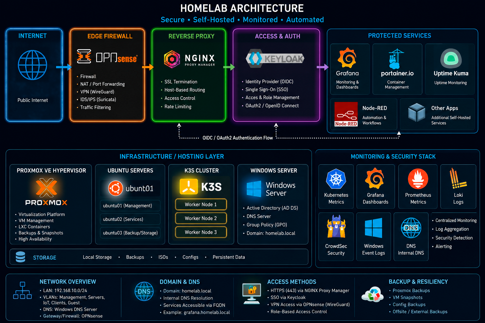

# Homelab Infrastructure Project



## Overview

This repository documents my hands-on IT homelab where I practice:

- Virtualization
- Linux administration
- Kubernetes
- Monitoring and observability
- Identity management
- Disaster recovery
- Reverse proxies
- Authentication workflows
- Windows infrastructure
- Security operations
- Infrastructure troubleshooting

The goal of this project is to build real-world infrastructure engineering experience through hands-on deployment, monitoring, security hardening, automation, and documentation.

---

## Infrastructure Overview

### Core Infrastructure

| Technology | Purpose |
|---|---|
| Proxmox VE | Virtualization platform |
| Ubuntu Server | Linux infrastructure |
| Windows Server | Active Directory and DNS |
| Docker | Containerized services |
| k3s Kubernetes | Container orchestration |

### Monitoring and Observability

| Technology | Purpose |
|---|---|
| Prometheus | Metrics collection |
| Grafana | Visualization dashboards |
| Loki | Log aggregation |
| Promtail | Log forwarding |
| Alertmanager | Infrastructure alerting |

### Security and Identity

| Technology | Purpose |
|---|---|
| Keycloak | Identity provider |
| oauth2-proxy | Authentication gateway |
| CrowdSec | Intrusion detection and response |
| Nginx Proxy Manager | Reverse proxy |

---

## Architecture

### Core Infrastructure Flow

```text
Internet
   ↓
OPNsense Firewall
   ↓
Nginx Proxy Manager
   ↓
Keycloak / oauth2-proxy
   ↓
Protected Services
   ├── Grafana
   ├── Portainer
   ├── Uptime Kuma
   └── Node-RED

Proxmox
   ├── Ubuntu Servers
   ├── k3s Kubernetes Cluster
   ├── Monitoring Stack
   ├── CrowdSec
   └── Windows Server DNS
```

---

## Major Skills Practiced

- Proxmox virtualization
- Linux server administration
- Kubernetes cluster deployment
- Infrastructure monitoring
- Metrics collection and visualization
- Centralized authentication with OIDC
- Reverse proxy management
- Docker container administration
- DNS and IP management
- Active Directory administration
- Group Policy management
- Backup and disaster recovery
- Infrastructure troubleshooting
- Security monitoring and detection engineering

---

## Documentation

### Infrastructure

- [Proxmox Cloud-Init Ubuntu Template](proxmox/cloud-init-template.md)
- [k3s Kubernetes Cluster Deployment](kubernetes/k3s-cluster.md)

### Monitoring and Observability

- [Prometheus, Grafana, Loki, and Alertmanager Monitoring](monitoring/prometheus-grafana.md)

### Security and Identity

- [CrowdSec Intrusion Detection and Response](security/crowdsec.md)
- [Keycloak Single Sign-On (SSO) Integration](security/keycloak-sso.md)
- [Nginx Proxy Manager and oauth2-proxy Integration](docker/npm-oauth2-proxy.md)

### Windows Infrastructure

- [Windows Server Active Directory and Group Policy](windows/active-directory-gpo.md)
- [Windows DNS and IP Management](windows/dns-ip-management.md)

### Disaster Recovery

- [Backup and Disaster Recovery](docs/backup-recovery.md)

---

## Screenshots

### Grafana Monitoring

Add Grafana dashboard screenshots here.

### CrowdSec Security Monitoring

Add CrowdSec dashboard screenshots here.

### Kubernetes Monitoring

Add Kubernetes dashboard screenshots here.

### Keycloak Authentication

Add Keycloak screenshots here.

---

## Technologies Used

- Proxmox VE
- Ubuntu Server
- Ubuntu Desktop
- Windows Server
- Windows 10/11 Pro
- Docker
- k3s Kubernetes
- Prometheus
- Grafana
- Loki
- Promtail
- Alertmanager
- CrowdSec
- Keycloak
- oauth2-proxy
- Nginx Proxy Manager
- Active Directory
- Group Policy
- Windows DNS
- OPNsense
- NAS backups
- Cloud-init templates

---

## Homelab Objectives

This homelab environment is used to practice:

- Infrastructure deployment
- Monitoring and observability
- Identity and access management
- Kubernetes administration
- Linux administration
- Windows infrastructure management
- Reverse proxy security
- Backup and disaster recovery
- Security monitoring
- Infrastructure troubleshooting
- Documentation and operational workflows

---

## Future Roadmap

Planned future improvements include:

- Multi-factor authentication (MFA)
- Wazuh security monitoring
- Terraform infrastructure provisioning
- Ansible automation
- GitOps workflows
- VLAN segmentation
- Kubernetes ingress controllers
- Longhorn distributed storage
- Automated backup validation
- Centralized SIEM integration
- Infrastructure-as-Code workflows
- Automated DNS management
- Proxmox API automation
- Infrastructure monitoring expansion

---

## Lessons Learned

This homelab project reinforced the importance of:

- Documentation
- Monitoring and observability
- Identity management
- Infrastructure repeatability
- Backup validation
- DNS reliability
- Authentication workflows
- Security visibility
- Structured troubleshooting

Building and troubleshooting real infrastructure provided hands-on experience that goes beyond theoretical learning.

---

## Repository Structure

```text
homelab-infrastructure/
│
├── README.md
│
├── diagrams/
│   ├── architecture/
│   ├── dashboards/
│   └── screenshots/
│
├── docker/
│   └── npm-oauth2-proxy.md
│
├── docs/
│   └── backup-recovery.md
│
├── kubernetes/
│   └── k3s-cluster.md
│
├── monitoring/
│   └── prometheus-grafana.md
│
├── proxmox/
│   └── cloud-init-template.md
│
├── security/
│   ├── crowdsec.md
│   └── keycloak-sso.md
│
├── windows/
│   ├── active-directory-gpo.md
│   └── dns-ip-management.md
│
└── scripts/
```
# homelab-infrastructure
