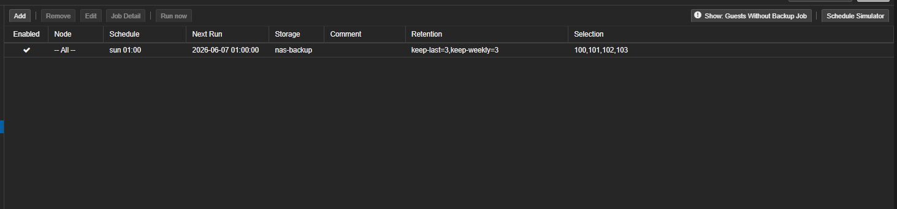
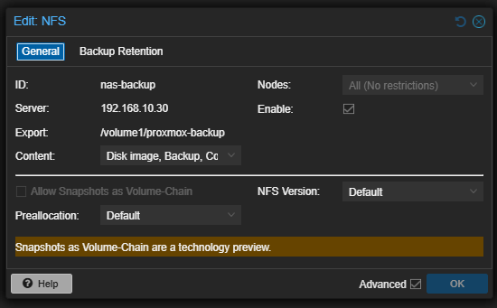
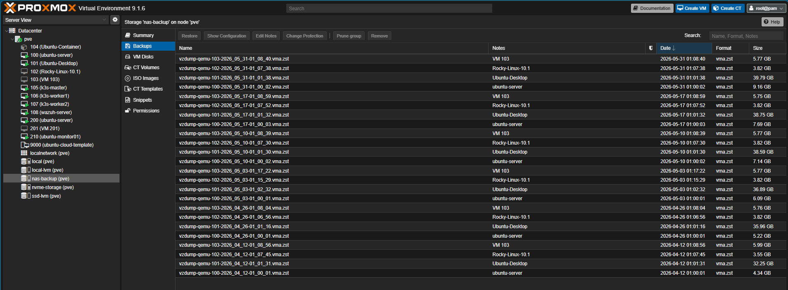
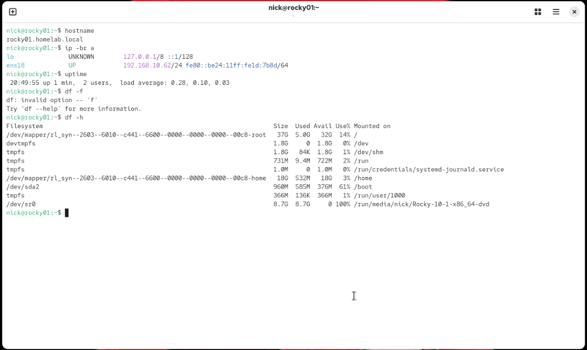

## Scheduled Backup Job

Proxmox is configured to run scheduled backups to NAS storage.

| Setting | Value |
|---|---|
| Backup Storage | nas-backup |
| Schedule | Sunday at 01:00 |
| Retention | keep-last=3, keep-weekly=3 |
| Selected VMs | 100, 101, 102, 103 |
| Backup Type | Scheduled VM backup |

This backup job provides recurring recovery points for core virtual machines in the homelab.



## NAS Backup Storage

Proxmox is configured to use an NFS share as backup storage.

| Setting | Value |
|---|---|
| Storage ID | nas-backup |
| Storage Type | NFS |
| NAS Server | 192.168.10.30 |
| Export Path | /volume1/proxmox-backup |
| Enabled | Yes |
| Content | Disk images, backups, container backups/templates |

Using NAS-backed storage keeps VM backups separate from the Proxmox host’s local disks. This improves disaster recovery because backup files remain available even if local VM storage has an issue.



## Backup File Verification

The NAS backup target was verified from within the Proxmox web interface. The `nas-backup` storage location contains multiple VM backup files in `.vma.zst` format.

Visible backups include:

| VM | Backup Example | Size |
|---|---|---:|
| ubuntu-server | vzdump-qemu-100 | 9.16 GB |
| Ubuntu-Desktop | vzdump-qemu-101 | 39.79 GB |
| Rocky-Linux-10.1 | vzdump-qemu-102 | 3.82 GB |
| VM 103 | vzdump-qemu-103 | 5.77 GB |

This confirms that scheduled Proxmox backups are being written to the NAS storage target successfully.



# Disaster Recovery Restore Test

## Overview

This section documents a Proxmox VM restore test using a Rocky Linux virtual machine backup stored on the `nas-backup` NFS storage target.

The purpose of this test was to verify that a VM backup could be restored from NAS storage, boot successfully, and pass basic system validation checks.

---

## Restore Test Summary

| Item | Result |
|---|---|
| Restored VM | Rocky-Linux-10.1 |
| Restored VM ID | 212 |
| Restored VM Name | Rocky-Linux-10.1-Restored |
| Backup Source | nas-backup |
| Restore Type | Test restore / clone |
| Hypervisor | Proxmox VE |
| Boot Successful | Yes |
| Console Access Verified | Yes |
| Filesystem Verified | Yes |
| Network Interface Detected | Yes |
| Validation Commands Completed | Yes |

---

## Restore Validation Commands

After restoring and booting the VM, I validated the restored system from the Linux terminal using the following commands:

```bash
hostname
ip -br a
uptime
df -h

```



**backup exists → restore performed → VM booted → system validated → risk noted → result confirmed**