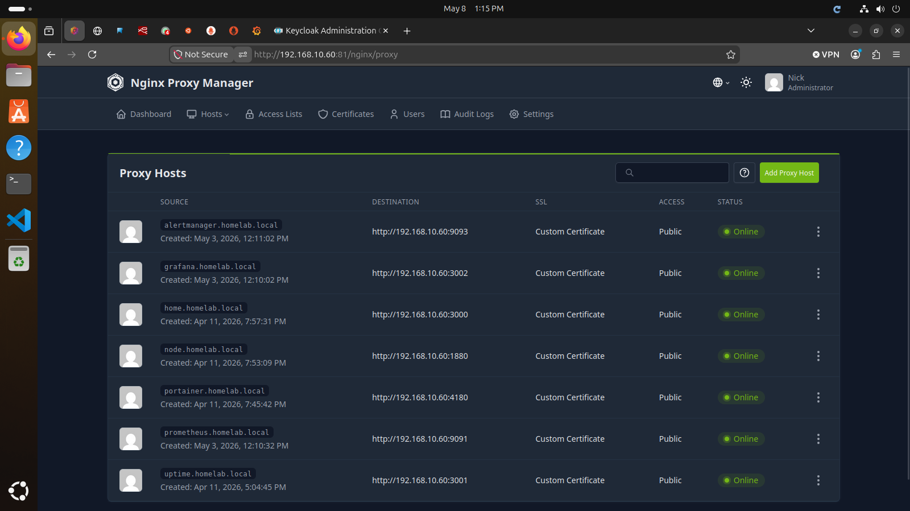

# Nginx Proxy Manager and oauth2-proxy Integration

## Overview

This document describes how I used Nginx Proxy Manager and oauth2-proxy to protect homelab services with centralized Keycloak authentication.

The goal was to place applications that do not support native SSO behind an authentication gateway.

## Goals

- Use Nginx Proxy Manager as the reverse proxy
- Use oauth2-proxy as an authentication gateway
- Use Keycloak as the identity provider
- Protect internal services with SSO
- Practice reverse proxy routing
- Practice OIDC authentication troubleshooting

## Environment

| Component | Purpose |
|---|---|
| Nginx Proxy Manager | Reverse proxy |
| oauth2-proxy | Authentication gateway |
| Keycloak | Identity provider |
| Windows DNS | Internal hostname resolution |
| Docker | Container runtime |

## Protected Services

Services protected through oauth2-proxy included:

- Portainer
- Uptime Kuma
- Node-RED

## Authentication Flow

```text
User Browser
      ↓
Nginx Proxy Manager
      ↓
oauth2-proxy
      ↓
Keycloak Login
      ↓
oauth2-proxy validates token
      ↓
Protected Application
```

## Reverse Proxy Design

Nginx Proxy Manager handled:

- Hostname routing
- TLS/HTTPS termination
- Proxy host management
- Forwarding traffic to oauth2-proxy
- Forwarding authenticated traffic to backend services

Example protected hostnames:

```text
uptime.homelab.local
portainer.homelab.local
nodered.homelab.local
```

## oauth2-proxy Role

oauth2-proxy acted as the security layer in front of applications that did not natively support OIDC.

It handled:

- Redirecting unauthenticated users to Keycloak
- Validating OIDC tokens
- Managing authentication sessions
- Forwarding authenticated requests
- Passing user headers to upstream services

## Example oauth2-proxy Configuration

Example configuration values:

```yaml
OAUTH2_PROXY_PROVIDER: oidc
OAUTH2_PROXY_CLIENT_ID: uptime-proxy
OAUTH2_PROXY_CLIENT_SECRET: REDACTED
OAUTH2_PROXY_OIDC_ISSUER_URL: http://keycloak.homelab.local/realms/homelab
OAUTH2_PROXY_REDIRECT_URL: http://uptime.homelab.local/oauth2/callback
OAUTH2_PROXY_EMAIL_DOMAINS: "*"
OAUTH2_PROXY_COOKIE_SECRET: REDACTED
OAUTH2_PROXY_UPSTREAMS: http://uptime-kuma:3001
OAUTH2_PROXY_HTTP_ADDRESS: 0.0.0.0:4180
```

## Keycloak Client Configuration

Each protected service required a Keycloak OIDC client.

Example clients:

| Client ID | Protected Service |
|---|---|
| uptime-proxy | Uptime Kuma |
| portainer-proxy | Portainer |
| nodered-proxy | Node-RED |

Example redirect URI:

```text
http://uptime.homelab.local/oauth2/callback
```

## Nginx Proxy Manager Configuration

In Nginx Proxy Manager, proxy hosts forwarded traffic to the oauth2-proxy container instead of directly to the application.

Example:

```text
uptime.homelab.local
        ↓
oauth2-proxy:4180
        ↓
uptime-kuma:3001
```

## DNS Requirements

Windows DNS was used to resolve internal service names.

Example DNS records:

```text
uptime.homelab.local     → 192.168.10.60
portainer.homelab.local  → 192.168.10.60
nodered.homelab.local    → 192.168.10.60
keycloak.homelab.local   → 192.168.10.60
```

All protected service hostnames pointed to the Nginx Proxy Manager host.

## Troubleshooting Performed

During integration, I troubleshot:

- Missing Keycloak login button
- Incorrect upstream ports
- 500 internal server errors
- 502 bad gateway errors
- Invalid redirect URI errors
- Failed token exchange errors
- Incorrect client secrets
- DNS resolution issues
- Reverse proxy routing problems
- oauth2-proxy container restart loops

## Example Issue: Invalid Redirect URI

An incorrect redirect URI caused Keycloak to reject login attempts.

Symptoms:

```text
Invalid parameter: redirect_uri
```

Resolution:

- Corrected the redirect URI in Keycloak
- Matched the oauth2-proxy callback URL
- Restarted oauth2-proxy
- Retested login flow

## Example Issue: Wrong Upstream Port

A proxy host was accidentally forwarded to the wrong port.

Symptoms:

- Wrong service loaded
- 502 Bad Gateway
- Authentication route failed

Resolution:

- Verified container port mappings
- Corrected Nginx Proxy Manager upstream port
- Restarted affected containers

## Skills Practiced

- Docker container networking
- Reverse proxy routing
- OIDC authentication
- oauth2-proxy configuration
- Keycloak client setup
- Internal DNS management
- Authentication troubleshooting
- Secure service exposure
- Infrastructure integration

## Results

Validated results included:

- oauth2-proxy protected multiple applications
- Keycloak handled centralized authentication
- Nginx Proxy Manager routed authenticated traffic
- Internal DNS resolved protected hostnames
- SSO workflow successfully protected services
- Troubleshooting improved understanding of authentication flows

## Lessons Learned

- oauth2-proxy is useful for protecting apps without native SSO.
- Redirect URIs must match exactly.
- Reverse proxy routing depends heavily on correct ports.
- DNS must work before authentication can work reliably.
- Small client secret or callback errors can break the full login flow.
- Layered access control reduces direct application exposure.

## Future Improvements

- Rebuild all oauth2-proxy clients after Keycloak recovery
- Add MFA in Keycloak
- Add role-based access per application
- Add centralized audit logging
- Move secrets into environment files
- Use Docker secrets or Vault for sensitive values
- Automate oauth2-proxy deployments
- Document per-service proxy configurations

