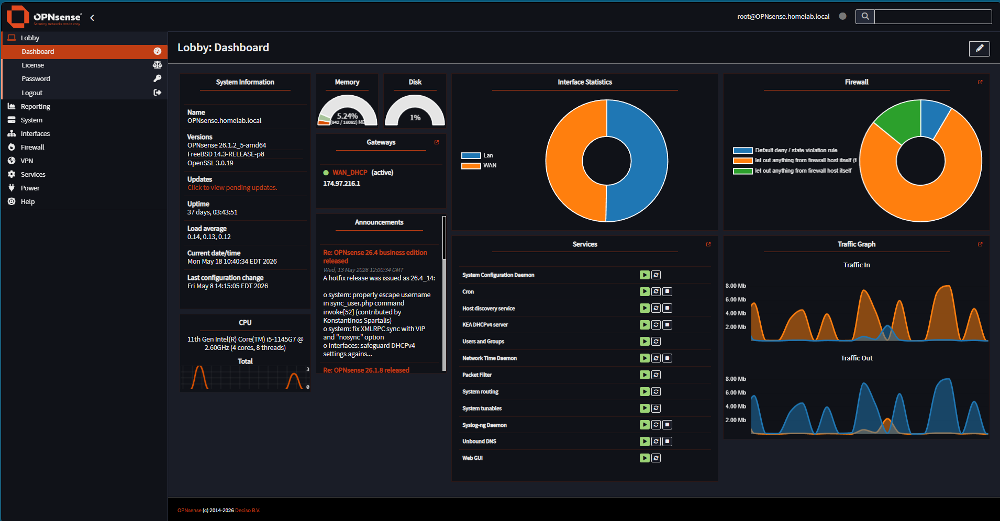
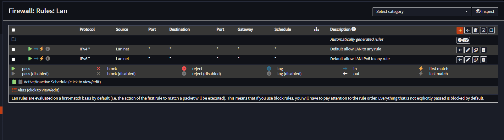
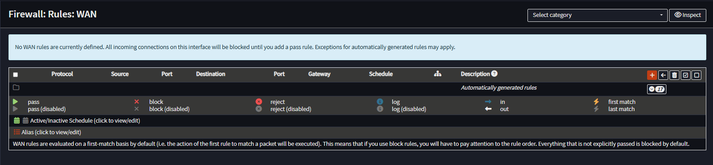

# OPNsense Firewall Appliance Build

## Overview

This document describes the dedicated firewall and routing appliance used in the homelab environment.

The firewall appliance acts as the primary network security gateway for the infrastructure and is responsible for:

- Network routing
- Firewall protection
- VPN support
- Internal network segmentation
- DNS forwarding
- Traffic management
- Infrastructure gateway services
- Homelab perimeter security

The appliance runs OPNsense and provides centralized network control for the homelab environment.

---

## Hardware Platform

| Component | Details |
|---|---|
| Platform | Partaker Mini PC Firewall Appliance |
| Model | H7-A |
| Form Factor | Fanless Mini PC |
| Cooling | Passive aluminum chassis |
| Deployment Type | 24/7 Infrastructure Appliance |

---

## CPU

| Component | Details |
|---|---|
| CPU Model | Intel Core i5-1135G7 / 1145G7 |
| Core Count | 4 Cores |
| Thread Count | 8 Threads |
| Integrated Graphics | Intel Integrated Graphics |
| Encryption Support | AES-NI |
| Virtualization Support | Hardware Virtualization Enabled |

### CPU Features

The processor supports:

- Hardware-accelerated encryption
- VPN acceleration
- Firewall packet processing
- Virtualization workloads
- Routing and NAT operations
- IDS/IPS workloads
- Multi-service networking

---

## Memory

| Component | Details |
|---|---|
| Installed Memory | 16 GB DDR4 |
| Maximum Supported Memory | 32 GB |
| Memory Slots | 2 DIMM Slots |

### Memory Usage Role

The memory configuration supports:

- OPNsense firewall services
- VPN sessions
- DNS forwarding
- IDS/IPS expansion
- Monitoring services
- Traffic management

---

## Storage Configuration

| Component | Details |
|---|---|
| Primary Storage | 256 GB SSD |
| Expansion Support | M.2 NVMe + 2.5-inch SATA |
| Storage Purpose | OPNsense OS and configuration storage |

### Storage Features

The appliance supports:

- Separate OS and data storage
- NVMe high-speed storage
- Additional SATA expansion
- Persistent firewall logging
- Configuration backup storage

---

## Networking

| Interface | Details |
|---|---|
| LAN Ports | 4 x Intel I226 2.5GbE |
| Networking Speed | 2.5 Gigabit Ethernet |
| NIC Type | Intel I226 |
| WAN/LAN Support | Multi-interface routing |

### Network Features

The firewall appliance supports:

- VLAN segmentation
- Multi-network routing
- Reverse proxy traffic
- Internal homelab routing
- Kubernetes traffic
- Monitoring traffic
- VPN connectivity
- DNS forwarding

---

## OPNsense Environment

### Primary Responsibilities

The OPNsense firewall handles:

- WAN connectivity
- Internal LAN routing
- Firewall rules
- DNS forwarding
- NAT management
- Infrastructure access control
- Internal traffic segmentation

### Example Infrastructure Traffic

The firewall routes traffic for:

- Proxmox VE
- Kubernetes cluster
- Grafana
- Prometheus
- Keycloak
- CrowdSec
- Portainer
- Uptime Kuma
- Windows Server DNS

---

## Homelab Role

The firewall appliance serves as the central network infrastructure component for the homelab environment.

### Core Infrastructure Responsibilities

- Gateway routing
- Firewall enforcement
- Infrastructure protection
- Internal DNS forwarding
- VPN access
- Traffic segmentation
- Reverse proxy support
- Infrastructure connectivity

---

## Cooling and Reliability

### Passive Cooling Design

The appliance uses:

- All-aluminum chassis
- Passive cooling
- Silent operation
- Multi-sided heat dissipation

### Operational Benefits

This design provides:

- Silent 24/7 operation
- Low maintenance
- Reduced failure points
- Stable thermal performance
- Reliable long-term uptime

---

## Security Features

| Feature | Purpose |
|---|---|
| AES-NI | Hardware encryption acceleration |
| Firewall Rules | Traffic filtering |
| VLAN Support | Network segmentation |
| VPN Support | Secure remote access |
| Watchdog Support | Automatic recovery |
| Network Boot Support | Infrastructure flexibility |

---

## Skills Practiced

- OPNsense administration
- Firewall rule management
- Network routing
- VLAN concepts
- VPN configuration
- DNS forwarding
- Infrastructure segmentation
- Network troubleshooting
- Gateway management
- Infrastructure security

---

## Lessons Learned

- Dedicated firewall appliances improve infrastructure security.
- AES-NI significantly improves VPN and encryption performance.
- Network segmentation improves infrastructure organization.
- Centralized routing simplifies infrastructure management.
- Silent passive cooling designs are effective for 24/7 homelab environments.
- Reliable networking infrastructure is foundational for virtualization and Kubernetes environments.

---

## Future Improvements

Planned future improvements include:

- VLAN segmentation expansion
- Site-to-site VPN configuration
- IDS/IPS deployment
- Traffic analytics integration
- Multi-WAN experimentation
- Network monitoring dashboards
- OPNsense backup automation
- Infrastructure traffic visualization
- Zero Trust network experiments
- Internal certificate authority integration

