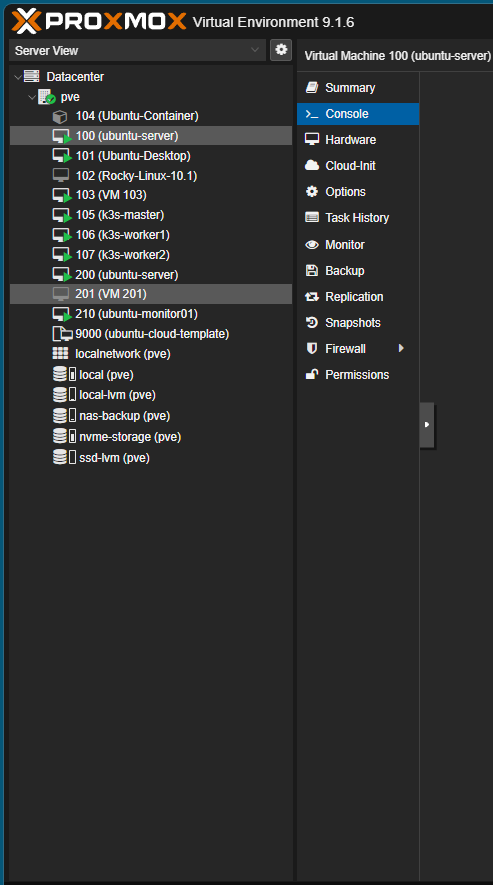
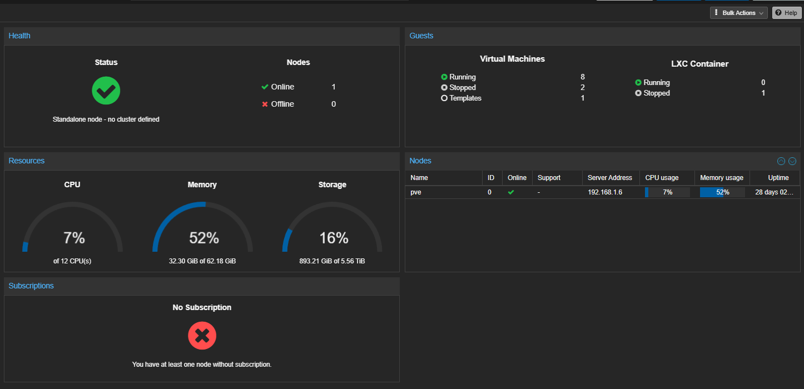
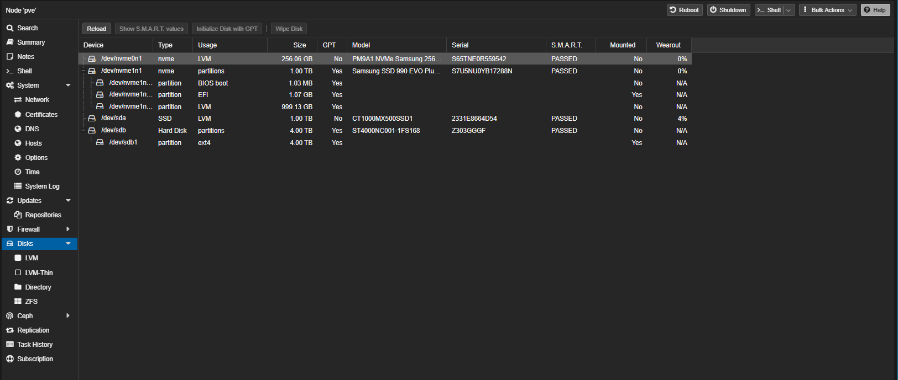
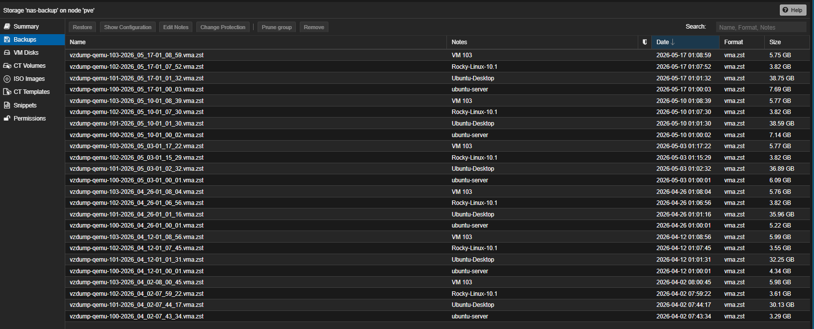

# Proxmox Virtualization Infrastructure

## Overview

My homelab infrastructure is built on top of a dedicated Proxmox Virtual Environment (PVE) host running multiple virtual machines and containers for monitoring, identity management, Kubernetes, Windows infrastructure services, and Linux administration.

The Proxmox server acts as the central virtualization platform for the entire environment and provides:

- Virtual machine management
- LXC container support
- Snapshot and backup management
- Multi-network segmentation
- Dedicated storage allocation
- Infrastructure isolation
- Kubernetes node hosting
- Monitoring stack hosting

---

# Proxmox Host Hardware

## System Specifications

| Component | Details |
|---|---|
| Motherboard | ASRock B550M Pro4 |
| CPU | AMD Ryzen 5 5600G |
| Cores / Threads | 6 Cores / 12 Threads |
| Memory | 64GB DDR4 |
| GPU | AMD Radeon RX 7600 |
| Hypervisor | Proxmox VE |
| Kernel | 6.17.13-2-pve |
| Virtualization | AMD-V / SVM Enabled |

---

# Storage Configuration

The Proxmox host uses multiple storage devices for virtualization workloads, backups, and VM separation.

| Device | Purpose |
|---|---|
| Samsung PM9A1 256GB NVMe | Primary OS / Proxmox |
| Samsung 990 EVO Plus 1TB NVMe | VM Storage |
| Crucial MX500 1TB SSD | Additional VM Storage |
| Seagate 4TB HDD | Backup Storage |

---

# Network Architecture

## Dual-NIC Configuration

The Proxmox server uses two dedicated network interfaces to separate infrastructure traffic from external connectivity.

| Interface | Purpose |
|---|---|
| NIC 1 | Internet / WAN Connectivity |
| NIC 2 | Internal Homelab Network |

This allows the environment to maintain separation between:

- Internet-facing traffic
- Internal infrastructure communication
- Kubernetes traffic
- Monitoring traffic
- Active Directory services
- Reverse proxy services

---

# Network Bridges

## vmbr0

Primary internal bridge used for:

- Virtual machines
- Kubernetes nodes
- Monitoring services
- Docker services
- Internal infrastructure communication

## vmbr1

Secondary bridge used for:

- WAN uplink
- External routing
- OPNsense connectivity
- Network segmentation

---

# Virtual Machines

The Proxmox environment hosts several Linux and Windows virtual machines used throughout the homelab.

## Linux Infrastructure

| VM | Purpose |
|---|---|
| ubuntu-server | Monitoring & Docker Services |
| ubuntu-monitor01 | Monitoring VM |
| Ubuntu-Container | Container Services |
| Rocky-Linux-10.1 | Linux Administration |
| k3s-master | Kubernetes Control Plane |
| k3s-worker1 | Kubernetes Worker |
| k3s-worker2 | Kubernetes Worker |

## Windows Infrastructure

| VM | Purpose |
|---|---|
| Windows Server | Active Directory / DNS / GPO |
| Windows 11 Pro | Administrative Workstation |

---

# Infrastructure Services Hosted

## Monitoring Stack

Hosted services include:

- Grafana
- Prometheus
- Loki
- Alertmanager
- Node Exporter

## Identity & Access Management

Hosted services include:

- Keycloak
- oauth2-proxy
- NGINX Proxy Manager

## Container Services

Hosted services include:

- Portainer
- Node-RED
- Uptime Kuma

## Kubernetes Environment

The Proxmox host also runs a multi-node K3S Kubernetes cluster consisting of:

- 1 Control Plane Node
- 2 Worker Nodes

---

# Virtualization Features Used

The Proxmox environment utilizes:

- VM snapshots
- VM backups
- Cloud-init templates
- Virtual bridges
- LVM storage
- ISO management
- Virtual TPM support
- Hardware virtualization passthrough
- Resource monitoring

---

# Backup Strategy

Backups are stored on dedicated backup storage and include:

- Scheduled VM backups
- Snapshot management
- Backup retention
- Disaster recovery preparation

---

# Screenshots

## Proxmox VM Infrastructure



---

## Proxmox Node Summary



---

## Proxmox Storage Devices



---

## Proxmox Backups



---

# Skills Demonstrated

- Virtualization
- Linux Administration
- Kubernetes Infrastructure
- Network Segmentation
- Infrastructure Monitoring
- Backup Management
- Storage Administration
- Hypervisor Management
- Infrastructure Automation
- Identity Management
- Enterprise Networking
```