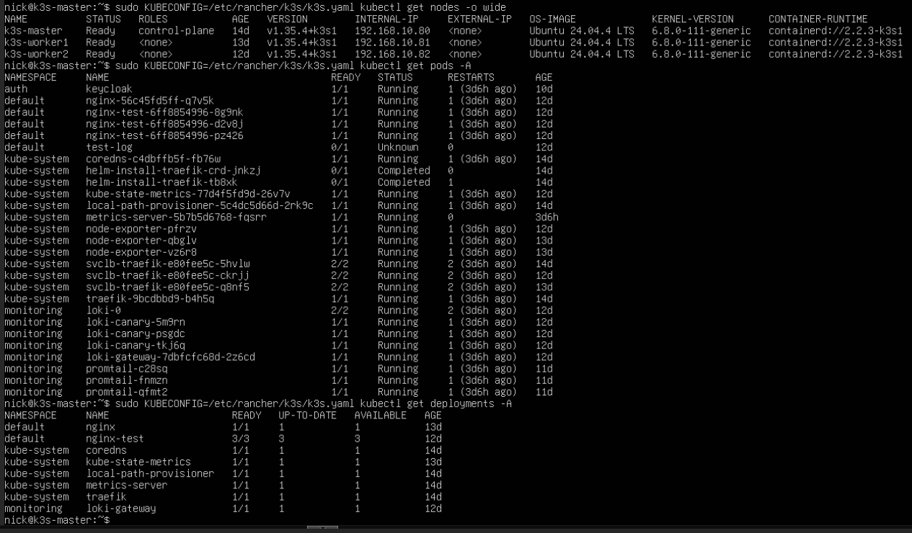

# k3s Kubernetes Cluster Deployment

## Overview

This document describes how I deployed and managed a multi-node k3s Kubernetes cluster in my homelab environment.

The cluster was built to practice:

- Kubernetes administration
- Container orchestration
- Cluster networking
- Monitoring and observability
- Linux troubleshooting
- Node management
- Infrastructure scaling

## Goals

- Deploy a lightweight Kubernetes cluster
- Configure a dedicated control plane node
- Add worker nodes to the cluster
- Monitor Kubernetes infrastructure
- Integrate Prometheus and Grafana
- Deploy kube-state-metrics
- Practice troubleshooting cluster issues
- Learn Kubernetes networking and services

## Environment

| Component | Description |
|---|---|
| Hypervisor | Proxmox VE |
| Kubernetes Distribution | k3s |
| Operating System | Ubuntu Server |
| Control Plane Node | k3s-master |
| Worker Nodes | k3s-worker1, k3s-worker2 |
| Monitoring Stack | Prometheus + Grafana |
| Metrics Exporters | node-exporter, kube-state-metrics |

## Cluster Topology

```text
k3s-master      192.168.10.80
k3s-worker1     192.168.10.81
k3s-worker2     192.168.10.82
```

## k3s Master Installation

The k3s control plane node was installed on Ubuntu Server.

Example installation command:

```bash
curl -sfL https://get.k3s.io | sh -
```

After installation, cluster status was verified.

```bash
sudo kubectl get nodes
```

Expected result:

```text
NAME           STATUS   ROLES                  AGE   VERSION
k3s-master     Ready    control-plane,master   ...
```

## Worker Node Installation

Worker nodes were joined to the cluster using the cluster token generated on the master node.

The node token was retrieved from the master server.

```bash
sudo cat /var/lib/rancher/k3s/server/node-token
```

Worker installation example:

```bash
curl -sfL https://get.k3s.io | \
K3S_URL=https://192.168.10.80:6443 \
K3S_TOKEN=REDACTED \
sh -
```

## Node Validation

Cluster node health was validated using:

```bash
sudo kubectl get nodes -o wide
```

Validation included:

- Node status
- Internal IP addresses
- Kubernetes versions
- Worker connectivity
- Control plane communication

## Kubernetes Monitoring

Prometheus and Grafana were integrated with the k3s cluster to monitor:

- Node CPU usage
- Memory utilization
- Cluster health
- Kubernetes object metrics
- Exporter availability
- Pod status

## kube-state-metrics Deployment

kube-state-metrics was deployed to expose Kubernetes cluster metrics.

Deployment validation:

```bash
kubectl get pods -A
```

Metrics endpoint validation:

```bash
curl http://192.168.10.82:30080/metrics
```

## Node Exporter Integration

Linux node metrics were exposed using prometheus-node-exporter.

Metrics exposed included:

- CPU usage
- Memory usage
- Disk utilization
- Network statistics
- Filesystem metrics

Prometheus scrape targets were configured for all cluster nodes.

## Grafana Dashboards

Grafana dashboards were imported to visualize:

- Kubernetes node health
- CPU utilization
- Memory usage
- Cluster metrics
- Exporter status
- Prometheus target health

Imported dashboard examples:

- Kubernetes cluster monitoring
- Node exporter dashboards
- Kubernetes infrastructure dashboards

## Troubleshooting Performed

During deployment and monitoring integration, I troubleshot several issues:

- Worker node installation failures
- Kubernetes node connectivity problems
- Duplicate IP address conflicts
- Prometheus scrape failures
- Grafana “No data” dashboard issues
- Incorrect metrics ports
- kube-state-metrics exposure issues
- DNS resolution problems
- Node exporter service issues
- Cluster communication troubleshooting

## Example Issues Resolved

### Duplicate Worker Node IP Address

At one point, two worker nodes accidentally shared the same IP address.

Symptoms included:

- Ping failures
- “Destination host unreachable”
- Node communication failures
- Prometheus target failures

Resolution:

- Reconfigured the duplicate IP address
- Restarted networking
- Revalidated cluster communication

### High CPU Utilization Investigation

A worker node temporarily reported 100% CPU utilization.

Troubleshooting included:

- Verifying running processes
- Reviewing Prometheus metrics
- Comparing node performance
- Validating cluster stability

The issue was determined to be related to testing activity and not persistent cluster instability.

## Skills Practiced

- Kubernetes cluster deployment
- k3s administration
- Linux server management
- Kubernetes node management
- Cluster troubleshooting
- Metrics collection
- Grafana dashboard integration
- Prometheus monitoring
- Infrastructure observability
- Networking troubleshooting
- DNS troubleshooting
- Monitoring validation

## Lessons Learned

- Kubernetes troubleshooting often involves both networking and metrics validation.
- Prometheus monitoring greatly improves cluster visibility.
- Duplicate IP addresses can create difficult-to-diagnose cluster issues.
- Monitoring systems should always be validated with direct metrics checks.
- Kubernetes worker nodes should be standardized whenever possible.
- Observability tools are critical for diagnosing cluster health.

## Results

Validated results included:

- Multi-node Kubernetes cluster operational
- Worker nodes successfully joined
- Cluster metrics successfully collected
- Prometheus scrape targets operational
- Grafana dashboards visualizing node metrics
- kube-state-metrics functioning correctly
- Linux exporters functioning correctly
- Cluster monitoring integrated into homelab observability stack

## Future Improvements

- Deploy MetalLB load balancing
- Add Kubernetes ingress controllers
- Add persistent storage integration
- Deploy production-style applications
- Implement GitOps workflows
- Deploy ArgoCD
- Integrate Longhorn storage
- Add Kubernetes backup automation
- Add Kubernetes security scanning
- Expand cluster node count

