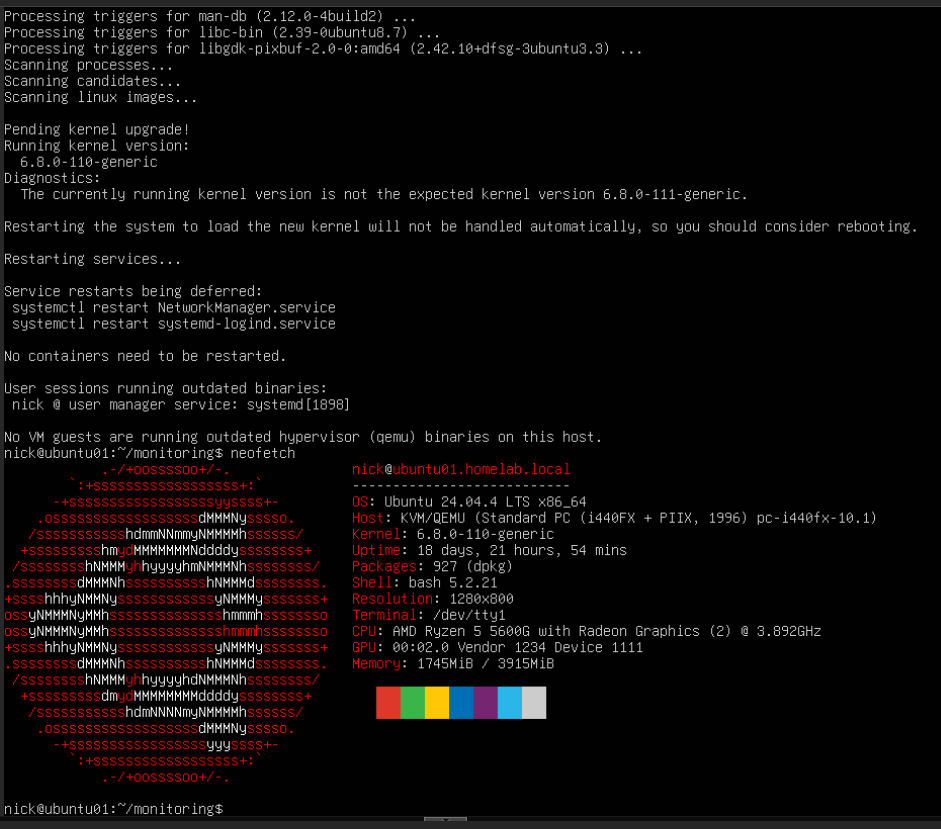
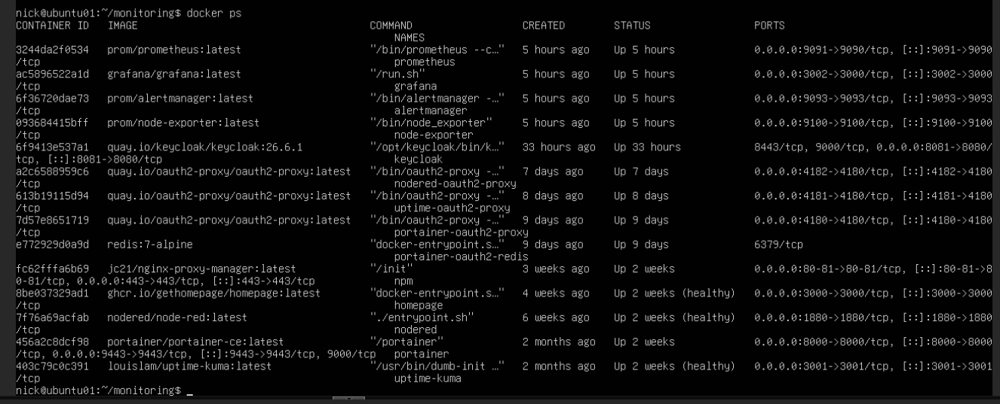

# Linux Server Infrastructure

## Overview

Linux systems are heavily integrated throughout the homelab environment and provide the foundation for virtualization, monitoring, Kubernetes orchestration, container hosting, automation, and infrastructure services.

The environment primarily uses:

- Ubuntu Server 24.04 LTS
- Debian (Proxmox Host)
- Rocky Linux
- K3S Kubernetes Nodes

Linux servers are used to host:

- Monitoring infrastructure
- Docker containers
- Kubernetes workloads
- Reverse proxies
- Identity management services
- Logging systems
- Automation services

---

# Linux Infrastructure Layout

## Core Linux Systems

| Hostname | Purpose |
|---|---|
| ubuntu01 | Monitoring & Docker Host |
| ubuntu-monitor01 | Monitoring VM |
| Ubuntu-Container | Container Services |
| Rocky-Linux-10.1 | Linux Administration |
| k3s-master | Kubernetes Control Plane |
| k3s-worker1 | Kubernetes Worker Node |
| k3s-worker2 | Kubernetes Worker Node |

---

# Linux Administration Tasks

Daily Linux administration tasks include:

- Package management
- System updates
- Service management
- Log analysis
- Network troubleshooting
- SSH administration
- Docker container management
- Kubernetes management
- Monitoring configuration
- DNS troubleshooting
- Firewall troubleshooting

---

# Linux Services Hosted

## Monitoring Stack

Linux servers host:

- Grafana
- Prometheus
- Loki
- Alertmanager
- Node Exporter

---

## Container Services

Docker containers hosted on Linux include:

- Keycloak
- oauth2-proxy
- Portainer
- Node-RED
- Uptime Kuma
- NGINX Proxy Manager

---

## Kubernetes Infrastructure

The Linux environment hosts a multi-node K3S cluster used for:

- Kubernetes administration
- Pod deployments
- Cluster monitoring
- Container orchestration
- Service testing
- Metrics collection

---

# Linux Networking

Linux servers are configured with:

- Static IP addressing
- Internal DNS resolution
- Reverse proxy routing
- SSH remote administration
- Virtual bridges
- Kubernetes networking

Example internal infrastructure services:

| Service | Hostname |
|---|---|
| Grafana | grafana.homelab.local |
| Keycloak | keycloak.homelab.local |
| Portainer | portainer.homelab.local |
| Prometheus | prometheus.homelab.local |
| Uptime Kuma | uptime.homelab.local |

---

# Linux Tools & Utilities

Common Linux tools used throughout the environment include:

```bash
kubectl
docker
docker compose
htop
curl
wget
nano
vim
systemctl
journalctl
ss
ip
ping
traceroute
```

---

# Docker Management

Linux servers are used to deploy and manage Docker containers using:

- Docker Engine
- Docker Compose
- Portainer
- Reverse proxies
- Container networking

---

# Kubernetes Management

Kubernetes management tasks include:

```bash
kubectl get nodes
kubectl get pods -A
kubectl get deployments -A
kubectl describe pods
kubectl logs
```

The Kubernetes cluster is monitored using Prometheus and Grafana dashboards.

---

# Monitoring & Observability

Linux systems are integrated into the observability stack using:

- Node Exporter
- Prometheus scraping
- Loki logging
- Grafana dashboards

Metrics collected include:

- CPU usage
- Memory usage
- Disk usage
- Node health
- Kubernetes health
- Service uptime

---

# Security & Access Management

Linux systems are integrated with centralized authentication using:

- Keycloak
- OAuth2 Proxy
- Reverse proxy authentication
- Internal DNS

SSH access is managed internally within the homelab network.

---

# Automation

Linux servers are also used for automation tasks including:

- Service startup automation
- Docker container deployment
- Monitoring automation
- IP verification scripts
- Kubernetes deployment automation

---

# Screenshots

## Linux Server Information



---

## Docker Containers



---

## Kubernetes Cluster


---

# Linux Skills Demonstrated

- Linux Administration
- Docker Management
- Kubernetes Administration
- Infrastructure Monitoring
- Service Management
- SSH Administration
- Networking
- Reverse Proxy Configuration
- DNS Management
- Infrastructure Troubleshooting
- Container Orchestration
- System Monitoring
- Automation
- Log Analysis
- Infrastructure Documentation