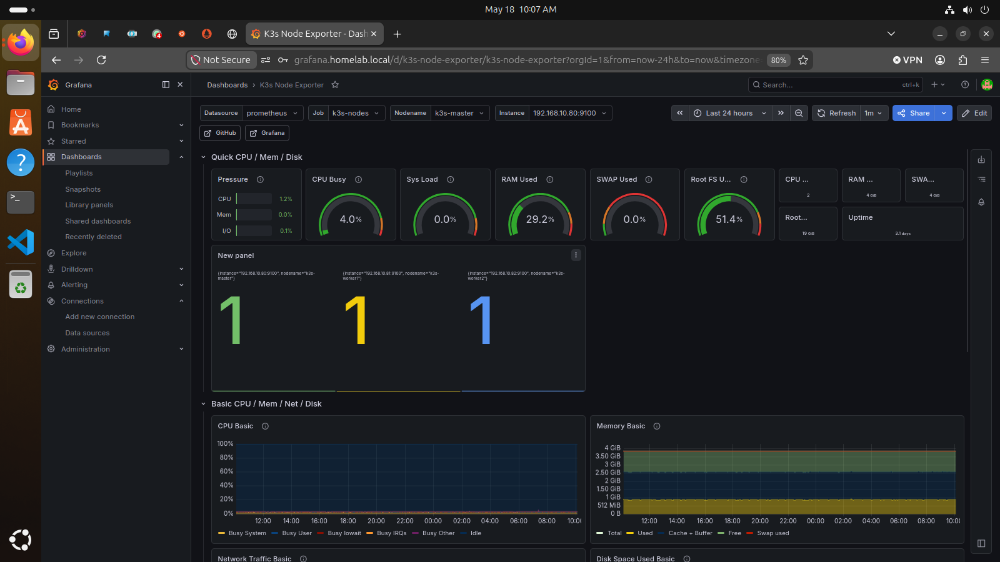
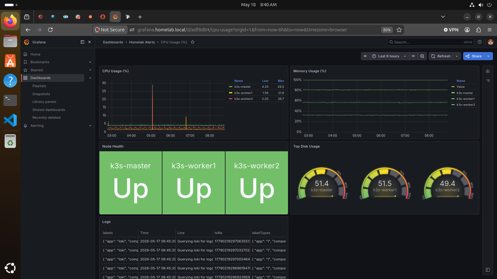

# Prometheus, Grafana, Loki, and Alertmanager Monitoring

## Overview

This document describes my homelab monitoring and observability setup. The goal of this project was to collect system metrics, visualize infrastructure health, monitor Kubernetes nodes, collect logs, and send alerts when services or targets go down.

## Environment

- Monitoring server: Ubuntu Server
- Metrics collection: Prometheus
- Visualization: Grafana
- Logs: Loki
- Log agent: Promtail
- Alerting: Alertmanager
- Exporters:
  - node-exporter
  - kube-state-metrics
  - CrowdSec metrics
- Monitored systems:
  - Ubuntu servers
  - k3s master node
  - k3s worker nodes
  - Docker services
  - CrowdSec
  - Nginx Proxy Manager

## Goals

- Deploy Prometheus for metrics collection
- Deploy Grafana for visualization
- Deploy Loki for log aggregation
- Configure Alertmanager for email alerts
- Monitor Linux hosts with node-exporter
- Monitor Kubernetes nodes and services
- Add CrowdSec security metrics
- Create dashboards for infrastructure health
- Troubleshoot target health and missing metrics

## Monitoring Architecture

```text
Linux Hosts / k3s Nodes / Services
        ↓
node-exporter / kube-state-metrics / CrowdSec metrics
        ↓
Prometheus
        ↓
Grafana Dashboards
        ↓
Alertmanager
        ↓
Email Alerts
```

## Prometheus Targets

Prometheus was configured to scrape multiple monitoring targets.

Example target groups:

| Job Name | Purpose |
|---|---|
| prometheus | Monitor Prometheus itself |
| node-exporter | Monitor Linux host system metrics |
| k3s-nodes | Monitor k3s node metrics |
| k3s-kube-state-metrics | Monitor Kubernetes object/state metrics |
| crowdsec | Monitor CrowdSec security metrics |

Example Prometheus scrape configuration:

```yaml
scrape_configs:
  - job_name: "prometheus"
    static_configs:
      - targets: ["localhost:9090"]

  - job_name: "node-exporter"
    static_configs:
      - targets:
          - "192.168.10.61:9100"
          - "192.168.10.20:9100"
          - "192.168.10.150:9100"

  - job_name: "k3s-nodes"
    static_configs:
      - targets:
          - "192.168.10.80:9100"
          - "192.168.10.81:9100"
          - "192.168.10.82:9100"

  - job_name: "crowdsec"
    static_configs:
      - targets:
          - "192.168.10.60:6060"
```

## Kubernetes Monitoring

The k3s cluster was added to Prometheus using node metrics and kube-state-metrics.

Monitored Kubernetes systems include:

- k3s master node
- k3s worker nodes
- kube-state-metrics
- Kubernetes pods
- Kubernetes services
- Kubernetes node health

One important troubleshooting step was identifying that the kube-state-metrics target worked correctly when using the NodePort endpoint:

```text
192.168.10.82:30080
```

Attempting to scrape the internal Kubernetes DNS name from outside the cluster failed because the external Prometheus server could not resolve internal cluster DNS names.

## Grafana Dashboards

Grafana was used to visualize:

- CPU usage
- Memory usage
- Disk usage
- Node health
- Prometheus target health
- Kubernetes cluster status
- CrowdSec metrics
- Service availability

Dashboards helped identify system health issues and confirm whether Prometheus targets were up or down.

## Loki Log Aggregation

Loki was added for centralized log aggregation, and Promtail was used to forward logs from monitored systems.

The goal of Loki was to provide centralized visibility into:

- Linux system logs
- Kubernetes logs
- Application logs
- Security-related logs
- Reverse proxy logs

Example Loki readiness check:

```bash
curl http://192.168.10.82:31748/ready
```

Expected result:

```text
ready
```

Promtail was configured to ship logs into Loki for centralized analysis and troubleshooting.

## Alertmanager Email Alerts

Alertmanager was configured to send email alerts when monitored services or targets went down.

Example alerting workflow:

```text
Prometheus detects target down
        ↓
Alert rule fires
        ↓
Alertmanager receives alert
        ↓
Email notification is sent
```

This was validated by receiving email alerts during monitoring tests.

## Troubleshooting Performed

During setup, I troubleshot several monitoring and observability issues:

- Prometheus targets showing as DOWN
- Incorrect scrape ports
- kube-state-metrics DNS resolution issues
- Node exporter missing on worker systems
- Grafana dashboards showing “No data”
- Existing dashboard/folder conflicts
- CrowdSec metrics initially binding only to localhost
- Prometheus scrape failures for CrowdSec
- Loki readiness validation
- Kubernetes worker node connectivity issues
- Duplicate IP address issues between worker nodes

## Skills Practiced

- Metrics collection with Prometheus
- Dashboard visualization with Grafana
- Linux monitoring with node-exporter
- Kubernetes monitoring with kube-state-metrics
- Log aggregation with Loki
- Log shipping with Promtail
- Infrastructure alerting with Alertmanager
- Prometheus scrape configuration
- Kubernetes observability
- Monitoring troubleshooting and validation

## Results

- Prometheus deployed and collecting metrics
- Grafana dashboards successfully imported and configured
- Linux host metrics successfully monitored
- k3s node metrics successfully collected
- kube-state-metrics successfully exposed through NodePort
- Loki installed and validated
- Alertmanager email notifications verified
- CrowdSec metrics integrated into Prometheus
- Monitoring stack used for infrastructure troubleshooting

## Lessons Learned

- Monitoring systems require both metric collection and validation.
- Kubernetes metrics often require external access methods such as NodePort.
- “No data” issues are commonly caused by incorrect ports, missing exporters, or datasource mismatches.
- Observability tools become much more valuable when integrated together.
- Alert testing is just as important as alert configuration.
- Log visibility significantly improves troubleshooting efficiency.

## Future Improvements

- Add Proxmox exporter metrics
- Add NAS storage monitoring
- Add Windows Server metrics
- Build a centralized infrastructure operations dashboard
- Add backup success/failure monitoring
- Integrate Wazuh security monitoring
- Add Grafana alert severity routing
- Create custom Kubernetes dashboards
- Add long-term metric retention


