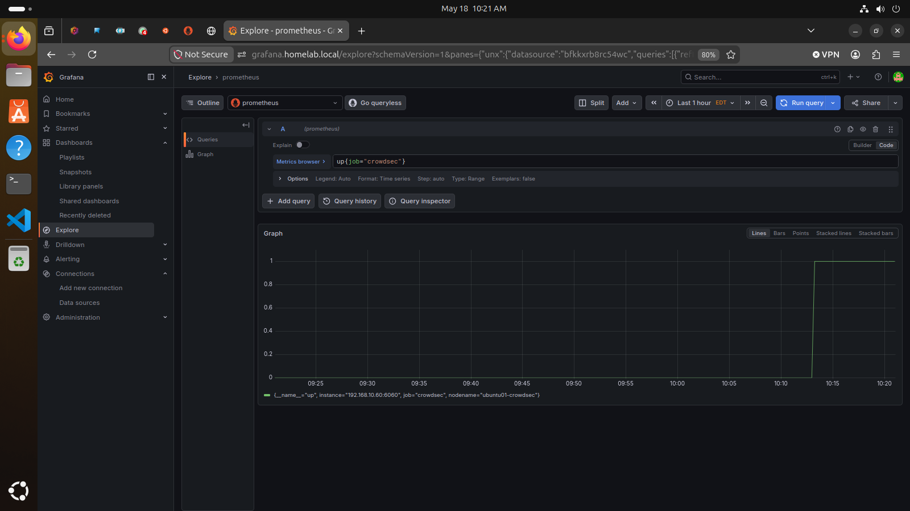
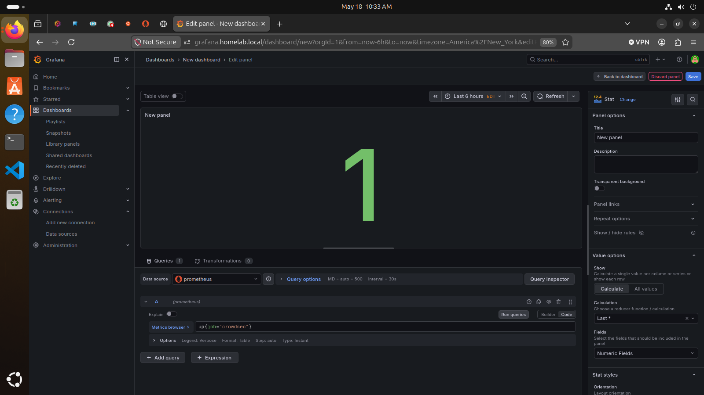

# CrowdSec Intrusion Detection and Response

## Overview

This document describes my CrowdSec security monitoring setup. The goal of this project was to detect suspicious activity, parse security logs, generate alerts, and automatically block malicious behavior in my homelab environment.

## Environment

- Server: Ubuntu Server
- Host IP: 192.168.10.60
- Security tool: CrowdSec
- Reverse proxy: Nginx Proxy Manager
- Monitoring: Prometheus and Grafana
- Protected services:
  - Grafana
  - Uptime Kuma
  - Portainer
  - Keycloak
  - Other homelab services

## Goals

- Install and configure CrowdSec
- Detect SSH brute-force attempts
- Enable firewall-based blocking
- Integrate Nginx Proxy Manager logs
- Parse web access logs
- Connect CrowdSec metrics to Prometheus
- Visualize security data in Grafana
- Practice detection engineering and troubleshooting

## CrowdSec Components Used

| Component | Purpose |
|---|---|
| CrowdSec Agent | Reads logs and detects suspicious behavior |
| Collections | Prebuilt detection rules and parsers |
| Scenarios | Define suspicious behavior patterns |
| Parsers | Convert raw logs into structured events |
| Bouncer | Applies blocking decisions |
| Prometheus Metrics | Exposes CrowdSec metrics for monitoring |

## SSH Brute-Force Detection

CrowdSec was configured to monitor SSH authentication logs using `journalctl`.

Example acquisition source:

```yaml
source: journalctl
journalctl_filter:
  - "_SYSTEMD_UNIT=ssh.service"
labels:
  type: syslog

  ```
I tested SSH brute-force detection by generating repeated failed login attempts from another VM.

Example test:

```bash
ssh fakeuser@192.168.10.60
```

After repeated failed login attempts, CrowdSec generated an alert and ban decision.

Example result:

```text
Reason: crowdsecurity/ssh-bf
Source IP: 192.168.10.150
Decision: ban
```

## Nginx Proxy Manager Log Integration

Nginx Proxy Manager logs were located inside the Docker volume:

```text
/var/lib/docker/volumes/npm_data/_data/logs/
```

Example log files:

```text
proxy-host-1_access.log
proxy-host-2_access.log
fallback_access.log
```

CrowdSec was configured to read Nginx Proxy Manager access logs.

Example acquisition:

```yaml
filenames:
  - /var/lib/docker/volumes/npm_data/_data/logs/proxy-host-*_access.log
labels:
  type: nginx-proxy-manager
```

## Parser Testing

I used `cscli explain` to verify that CrowdSec could parse Nginx Proxy Manager logs.

Example command:

```bash
sudo cscli explain --type nginx-proxy-manager --verbose --log 'LOG_LINE_HERE'
```

The parser successfully extracted useful fields, including:

```text
evt.Meta.source_ip
evt.Meta.http_path
evt.Meta.service
evt.Meta.http_user_agent
evt.Meta.target_fqdn
```

This confirmed that CrowdSec could understand traffic passing through Nginx Proxy Manager.

## Prometheus and Grafana Integration

CrowdSec metrics were exposed on port `6060` and added to Prometheus as a scrape target.

Example Prometheus job:

```yaml
- job_name: "crowdsec"
  static_configs:
    - targets:
        - "192.168.10.60:6060"
      labels:
        nodename: ubuntu01-crowdsec
```

Prometheus successfully scraped the CrowdSec target, and Grafana was used to visualize CrowdSec metrics.

## Troubleshooting Performed

During setup, I troubleshot several issues:

- CrowdSec was not detecting SSH attempts at first
- SSH logs used `ssh.service` instead of `sshd.service`
- Local network IPs were initially whitelisted
- Nginx Proxy Manager logs required the correct parser type
- `cscli explain` was used to inspect parsed log fields
- Prometheus metrics caused a protobuf-related crash during testing
- Grafana dashboard import required the correct CrowdSec dashboard
- HTTP scenarios parsed successfully but required further tuning to generate reliable alerts

## Skills Practiced

- Linux security monitoring
- SSH brute-force detection
- Log acquisition and parsing
- Firewall-based response
- Reverse proxy security
- Nginx Proxy Manager log analysis
- Prometheus metrics integration
- Grafana dashboard setup
- Detection engineering
- Troubleshooting security pipelines

## Results

- CrowdSec installed and running
- SSH brute-force detection validated
- Firewall bouncer installed and connected
- SSH attack source was detected and banned
- Nginx Proxy Manager logs located and parsed
- CrowdSec metrics connected to Prometheus
- Grafana dashboard imported for CrowdSec visibility
- Parser troubleshooting completed using real log data

## Lessons Learned

- Detection tools depend heavily on correct log sources.
- Parser testing is important before relying on alerts.
- A system can ingest logs without triggering alerts if scenario thresholds are not met.
- Whitelists can prevent expected detections during testing.
- Reverse proxy authentication can reduce application exposure before attacks reach backend services.
- Security monitoring requires both detection and validation.

## Future Improvements

- Tune custom HTTP detection scenarios
- Re-enable and stabilize CrowdSec Prometheus metrics
- Add dashboards for bans, alerts, and suspicious IPs
- Integrate CrowdSec alerts into Grafana or Alertmanager
- Add Wazuh for Windows and Linux endpoint monitoring
- Monitor Windows Server security events
- Document incident response procedures


