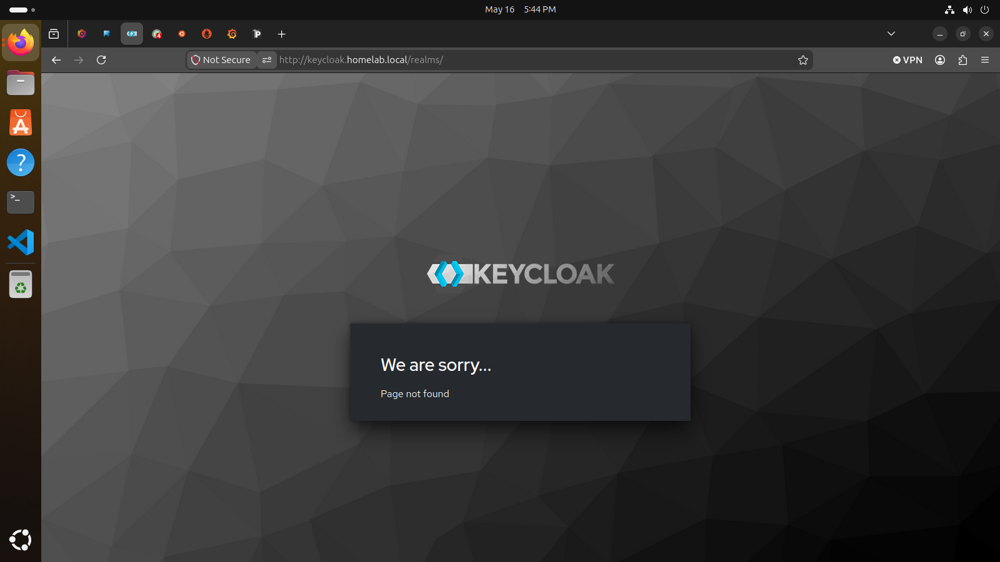
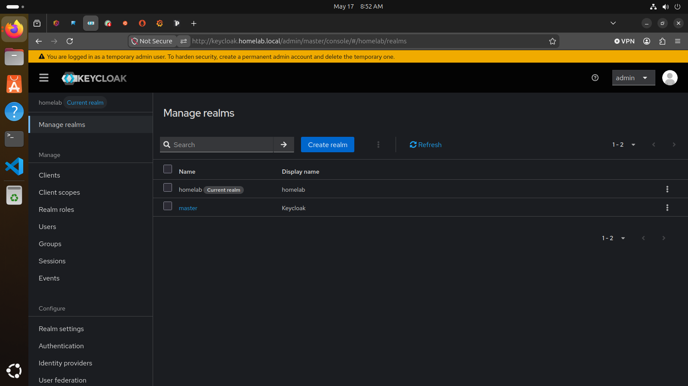

# Keycloak Single Sign-On (SSO) Integration

## Overview

This document describes how I deployed and integrated Keycloak Single Sign-On (SSO) into my homelab environment.

The goal was to centralize authentication across infrastructure services and practice identity management, reverse proxy integration, and OpenID Connect (OIDC) authentication workflows.

## Goals

- Deploy Keycloak identity management
- Centralize authentication across services
- Configure OpenID Connect (OIDC)
- Integrate Grafana with Keycloak
- Protect services using oauth2-proxy
- Use Nginx Proxy Manager as a reverse proxy
- Practice authentication troubleshooting
- Learn SSO and identity management concepts

## Environment

| Component | Purpose |
|---|---|
| Keycloak | Identity Provider (IdP) |
| Grafana | Native OIDC authentication |
| oauth2-proxy | Authentication gateway |
| Nginx Proxy Manager | Reverse proxy |
| Portainer | Protected application |
| Uptime Kuma | Protected application |
| Node-RED | Protected application |
| Windows DNS | Internal homelab DNS |
| Domain | homelab.local |

## Authentication Architecture

```text
User Browser
      ↓
Nginx Proxy Manager
      ↓
oauth2-proxy
      ↓
Keycloak
      ↓
Protected Application
```

Grafana used native OIDC authentication directly with Keycloak.

Other services used:

```text
Application
    ↓
oauth2-proxy
    ↓
Keycloak
```

## Keycloak Deployment

Keycloak was deployed as the central authentication provider for the homelab environment.

Responsibilities included:

- User authentication
- Role assignment
- OIDC token generation
- Session management
- Centralized login handling

## Realm Configuration

A dedicated homelab realm was created.

Example realm:

```text
homelab
```

The realm was used to isolate authentication and role management for homelab services.

## User and Role Management

Users and roles were created inside Keycloak.

Example roles:

```text
homelab-admin
homelab-viewer
```

Example user:

```text
viewer-test
```

Role mappings were used to control application permissions.

## Grafana OIDC Integration

Grafana was configured to authenticate directly against Keycloak using OpenID Connect.

Integration goals:

- Centralized authentication
- Role-based access
- Automatic login redirection
- Unified credentials

Grafana configuration included:

```ini
[auth.generic_oauth]
enabled = true
name = Keycloak
allow_sign_up = true
client_id = grafana
client_secret = REDACTED
scopes = openid email profile
auth_url = https://keycloak.homelab.local/realms/homelab/protocol/openid-connect/auth
token_url = https://keycloak.homelab.local/realms/homelab/protocol/openid-connect/token
api_url = https://keycloak.homelab.local/realms/homelab/protocol/openid-connect/userinfo
```

## oauth2-proxy Integration

oauth2-proxy was deployed to protect applications that did not support native OIDC authentication.

Protected applications included:

- Portainer
- Uptime Kuma
- Node-RED

Authentication flow:

```text
User Request
    ↓
oauth2-proxy
    ↓
Keycloak Login
    ↓
OIDC Token Validation
    ↓
Application Access Granted
```

## Nginx Proxy Manager Integration

Nginx Proxy Manager was used as the reverse proxy layer for all protected services.

Responsibilities included:

- HTTPS reverse proxying
- Forwarding authentication headers
- Proxy routing
- Service exposure
- TLS termination

Example protected service URLs:

```text
grafana.homelab.local
uptime.homelab.local
portainer.homelab.local
```

## DNS Integration

Windows Server DNS was used for internal homelab name resolution.

Example internal DNS records:

```text
grafana.homelab.local
keycloak.homelab.local
uptime.homelab.local
portainer.homelab.local
```

DNS troubleshooting became an important part of validating authentication and proxy routing.

## Authentication Validation

Authentication testing included:

- Successful login redirects
- OIDC token generation
- Role-based access validation
- Reverse proxy validation
- Session handling verification
- Multi-service login testing

## Troubleshooting Performed

During deployment and integration, I troubleshot several issues:

- Incorrect client secrets
- Invalid redirect URIs
- Missing Grafana login buttons
- oauth2-proxy configuration issues
- Reverse proxy forwarding issues
- Nginx upstream port mismatches
- Internal DNS resolution failures
- OIDC token failures
- Keycloak role mapping issues
- Header forwarding problems
- 500 internal server errors
- 502 bad gateway responses

## Example Problems Resolved

### Invalid Redirect URI

An incorrect redirect URI caused authentication failures.

Symptoms included:

- Login loops
- “Invalid parameter: redirect_uri”
- OIDC authentication failure

Resolution:

- Corrected redirect URI settings in Keycloak
- Revalidated oauth2-proxy callback URLs
- Restarted proxy services

### Incorrect Client Secret

A Grafana login failure was traced to a client secret typo.

Symptoms included:

- “Failed to get token from provider”
- Login failure after successful redirect

Resolution:

- Corrected the client secret
- Restarted Grafana authentication services
- Revalidated OIDC login flow

## Skills Practiced

- Identity management
- OpenID Connect (OIDC)
- Single Sign-On (SSO)
- Reverse proxy integration
- Linux administration
- Authentication troubleshooting
- DNS troubleshooting
- Header forwarding
- Role-based access control
- Infrastructure integration

## Lessons Learned

- Identity management systems depend heavily on DNS and reverse proxy correctness.
- OIDC integrations require exact redirect URI matching.
- Small configuration mistakes can completely break authentication workflows.
- Centralized authentication greatly simplifies infrastructure management.
- Authentication troubleshooting often requires validating logs across multiple systems.
- Reverse proxy configuration is critical for modern infrastructure security.

## Results

Validated results included:

- Centralized authentication successfully deployed
- Grafana integrated with native OIDC authentication
- oauth2-proxy protecting multiple applications
- Keycloak serving as centralized identity provider
- Internal DNS successfully resolving protected services
- Reverse proxy authentication functioning correctly
- Role-based access control operational

## Future Improvements

- Add multi-factor authentication (MFA)
- Integrate Active Directory authentication
- Add automatic certificate management
- Implement group-based role mapping
- Add audit logging dashboards
- Deploy high-availability Keycloak
- Add external authentication providers
- Implement automated configuration backups

## Troubleshooting Example: Keycloak Loading Failure

During testing, Keycloak occasionally failed to load correctly through the reverse proxy.

Observed behavior included:

- “Page not found” errors
- Reverse proxy routing failures
- Incorrect realm URL handling
- DNS or upstream proxy issues

Example failure screenshot:



Troubleshooting steps included:

- Validating Nginx Proxy Manager upstream settings
- Verifying Keycloak container status
- Checking reverse proxy forwarding rules
- Reviewing DNS resolution
- Validating Keycloak realm paths
- Reviewing Docker container logs
- Restarting proxy and authentication services

This troubleshooting process improved understanding of:

- Reverse proxy behavior
- Authentication routing
- OIDC URL structure
- Internal DNS dependencies
- Service integration troubleshooting

## Keycloak Recovery and Rebuild

At one point during troubleshooting, the Keycloak container was no longer present on the Docker host.

Observed symptoms included:

- Keycloak login failures
- oauth2-proxy authentication failures
- “Failed to get token from provider” errors
- Missing Keycloak container in Docker
- Missing Keycloak compose deployment

Investigation steps included:

```bash
docker ps
docker ps -a
find ~ -iname "*keycloak*"
docker volume ls
```

A clean Keycloak deployment was rebuilt using Docker Compose with persistent storage.

Example deployment:

```yaml
services:
  keycloak:
    image: quay.io/keycloak/keycloak:26.6.1
    container_name: keycloak
    restart: unless-stopped
    command: start-dev
    environment:
      KC_BOOTSTRAP_ADMIN_USERNAME: admin
      KC_BOOTSTRAP_ADMIN_PASSWORD: REDACTED
      KC_HOSTNAME: keycloak.homelab.local
      KC_PROXY_HEADERS: xforwarded
      KC_HTTP_ENABLED: "true"
    ports:
      - "8081:8080"
    volumes:
      - keycloak_data:/opt/keycloak/data
```

After rebuilding Keycloak:

- The `homelab` realm was recreated
- Grafana OIDC integration was restored
- New OIDC client secrets were generated
- User accounts were recreated
- SSO login functionality was validated successfully

This troubleshooting process reinforced the importance of:

- Persistent storage
- Configuration backups
- Identity provider availability
- Authentication dependency mapping
- Infrastructure documentation

