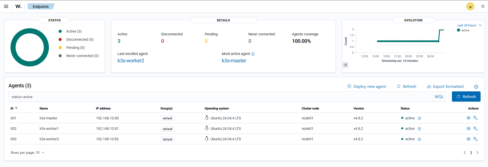
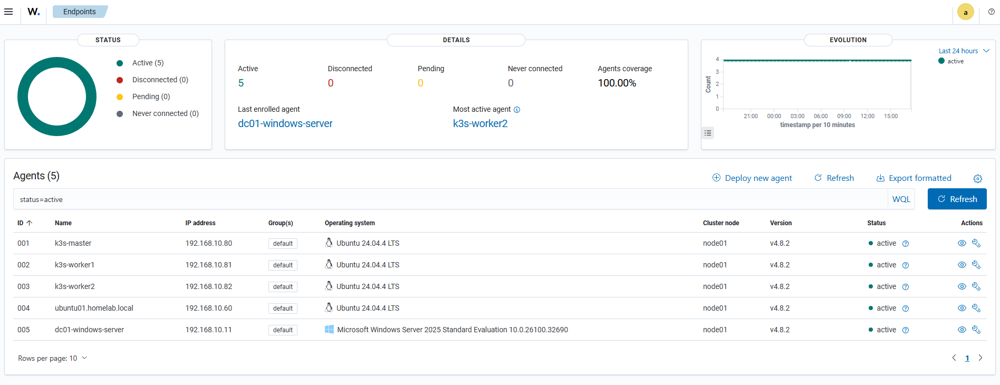
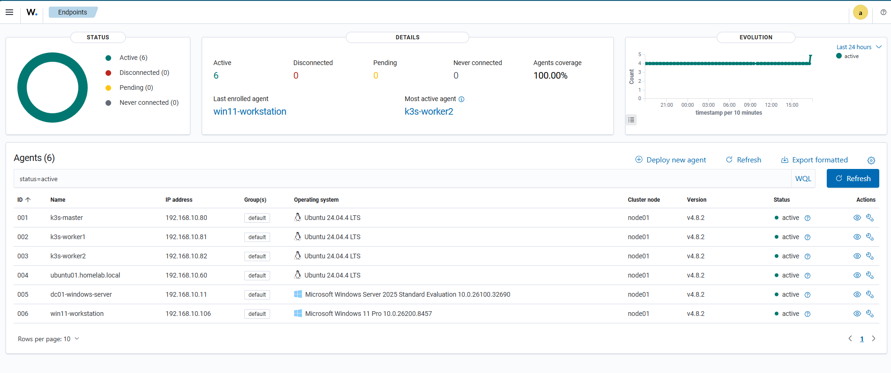

# Wazuh SIEM and Endpoint Security Monitoring

## Overview

This document describes how I deployed Wazuh in my homelab as a SIEM/XDR platform for endpoint security monitoring.

The goal of this project was to safely deploy Wazuh in an isolated virtual machine, enroll Linux endpoints, and begin monitoring Kubernetes infrastructure without disrupting the rest of the homelab.

Wazuh is used to practice:

- Security monitoring
- Endpoint detection
- Agent deployment
- Linux log collection
- Vulnerability visibility
- Security event analysis
- SIEM/XDR concepts
- Infrastructure troubleshooting

---

## Goals

- Deploy Wazuh safely in an isolated VM
- Avoid disrupting existing homelab services
- Install and configure Wazuh Manager, Indexer, and Dashboard
- Enroll k3s Linux nodes as Wazuh agents
- Validate agent communication
- Troubleshoot Wazuh agent issues
- Document security monitoring workflows
- Capture screenshots for GitHub documentation

---

## Environment

| Component | Details |
|---|---|
| Hypervisor | Proxmox VE |
| Wazuh Server VM | wazuh-server |
| Wazuh Server IP | 192.168.10.90 |
| Operating System | Ubuntu Server |
| Wazuh Version | 4.8.2 |
| Agent Version | 4.8.2 |
| Monitored Nodes | k3s-master, k3s-worker1, k3s-worker2 |

---

## Wazuh Server VM

The Wazuh server was deployed as a dedicated Proxmox VM to isolate the SIEM platform from the rest of the homelab.

Recommended VM resources:

| Resource | Value |
|---|---|
| CPU | 4 cores |
| RAM | 8 GB |
| Disk | 120 GB |
| Network | vmbr0 |
| Static IP | 192.168.10.90 |

A dedicated VM was used so that if Wazuh failed or consumed too many resources, it would not break existing services such as:

- Grafana
- Prometheus
- Keycloak
- Nginx Proxy Manager
- Portainer
- Kubernetes
- Windows Server DNS

---

## Safety Steps Before Installation

Before installing Wazuh, I took several precautions:

- Created a dedicated VM
- Assigned a static IP address
- Installed the Proxmox QEMU guest agent
- Updated Ubuntu packages
- Verified network connectivity
- Took a Proxmox snapshot before installation

Snapshot name:

```text
before-wazuh-install
```

This provided a rollback point in case the Wazuh installation failed or caused instability.

---

## Wazuh Installation

Wazuh was installed using the assisted installation method.

Example install command:

```bash
curl -sO https://packages.wazuh.com/4.8/wazuh-install.sh
sudo bash ./wazuh-install.sh -a
```

The installation deployed:

- Wazuh Manager
- Wazuh Indexer
- Wazuh Dashboard

After installation, the Wazuh dashboard was accessible at:

```text
https://192.168.10.90
```

---

## Initial Dashboard Validation

After installation, the Wazuh dashboard loaded successfully.

At first, the dashboard showed:

```text
No agents were added to this manager
```

This confirmed that the Wazuh server was running, but no endpoints were reporting yet.

---

## Agent Deployment Strategy

To avoid breaking the environment, agents were deployed slowly and intentionally.

Deployment order:

1. k3s-master
2. k3s-worker1
3. k3s-worker2

This staged rollout helped confirm that each agent worked before moving to the next system.

---

## Monitored Agents

| Agent | IP Address | OS | Status |
|---|---|---|---|
| k3s-master | 192.168.10.80 | Ubuntu 24.04 LTS | Active |
| k3s-worker1 | 192.168.10.81 | Ubuntu 24.04 LTS | Active |
| k3s-worker2 | 192.168.10.82 | Ubuntu 24.04 LTS | Active |

---

## Agent Installation

The Wazuh manager was version `4.8.2`, so the same agent version was installed on the Linux nodes.

Example download command:

```bash
curl -so wazuh-agent-4.8.2-1_amd64.deb https://packages.wazuh.com/4.x/apt/pool/main/w/wazuh-agent/wazuh-agent_4.8.2-1_amd64.deb
```

Example installation command:

```bash
sudo WAZUH_MANAGER='192.168.10.90' dpkg -i ./wazuh-agent-4.8.2-1_amd64.deb
```

The agent service was enabled and started:

```bash
sudo systemctl daemon-reload
sudo systemctl enable wazuh-agent
sudo systemctl start wazuh-agent
```

Agent status was verified with:

```bash
sudo systemctl status wazuh-agent
```

Expected result:

```text
active (running)
```

---

## Agent Configuration

The Wazuh agent configuration points to the Wazuh manager.

Config file:

```text
/var/ossec/etc/ossec.conf
```

Example client configuration:

```xml
<client>
  <server>
    <address>192.168.10.90</address>
    <port>1514</port>
    <protocol>tcp</protocol>
  </server>
</client>
```

---

## Connectivity Validation

Connectivity from the agent to the Wazuh server was tested using `netcat`.

```bash
nc -zv 192.168.10.90 1514
```

Expected result:

```text
Connection to 192.168.10.90 1514 port [tcp/*] succeeded!
```

The registration port was also tested:

```bash
nc -zv 192.168.10.90 1515
```

Expected result:

```text
Connection to 192.168.10.90 1515 port [tcp/*] succeeded!
```

---

## Troubleshooting Performed

During deployment, I troubleshot several issues.

### Version Mismatch

The first agent installed was newer than the Wazuh manager.

Observed error:

```text
Agent version must be lower or equal to manager version
```

Cause:

```text
Wazuh manager: 4.8.2
Wazuh agent: 4.13.1
```

Resolution:

- Removed the newer agent
- Installed matching agent version `4.8.2`
- Restarted the Wazuh agent service
- Verified agent connectivity

---

### Invalid Manager Address

An agent failed to start because the manager address was still set to a placeholder.

Observed error:

```text
Invalid server address found: 'MANAGER_IP'
No client configured. Exiting.
```

Resolution:

Edited:

```text
/var/ossec/etc/ossec.conf
```

Changed:

```xml
<address>MANAGER_IP</address>
```

to:

```xml
<address>192.168.10.90</address>
```

Then restarted the agent:

```bash
sudo systemctl restart wazuh-agent
```

---

### Missing Agent Package File

On one worker node, I attempted to install the agent before downloading the `.deb` file.

Observed error:

```text
cannot access archive './wazuh-agent-4.8.2-1_amd64.deb': No such file or directory
```

Resolution:

Downloaded the package first, verified it existed, then installed it.

```bash
curl -so wazuh-agent-4.8.2-1_amd64.deb https://packages.wazuh.com/4.x/apt/pool/main/w/wazuh-agent/wazuh-agent_4.8.2-1_amd64.deb
ls -lh wazuh-agent-4.8.2-1_amd64.deb
```

---

## Dashboard Validation

After all three agents were installed, the Wazuh dashboard showed:

```text
Active agents: 3
Disconnected agents: 0
Pending agents: 0
Never connected agents: 0
Agent coverage: 100%
```

Agents listed:

- k3s-master
- k3s-worker1
- k3s-worker2

This confirmed that the Kubernetes nodes were successfully enrolled and reporting to Wazuh.

---

## Screenshots

### Wazuh k3s Agents



### Wazuh Linux and Windows Agents



### Wazuh All Agents Active



---

## Skills Practiced

- Wazuh SIEM deployment
- Linux endpoint monitoring
- Agent enrollment
- Security monitoring
- Service troubleshooting
- Version compatibility troubleshooting
- Network port validation
- Proxmox VM isolation
- Linux service management
- Kubernetes node monitoring
- SIEM/XDR fundamentals

---

## Results

Validated results included:

- Wazuh server successfully deployed
- Dashboard accessible over HTTPS
- k3s-master agent enrolled
- k3s-worker1 agent enrolled
- k3s-worker2 agent enrolled
- All agents active
- Agent coverage reached 100%
- Version mismatch issue resolved
- Manager connectivity validated
- Wazuh deployed safely without breaking the rest of the homelab

---

## Lessons Learned

- Wazuh agents must be the same version or older than the Wazuh manager.
- SIEM tools should be deployed in isolated VMs to avoid disrupting production lab services.
- Proxmox snapshots are important before major infrastructure changes.
- Agent logs are essential for troubleshooting enrollment failures.
- Port testing helps confirm communication between agent and manager.
- Slow staged deployment is safer than deploying agents everywhere at once.
- Wazuh provides stronger endpoint visibility than basic infrastructure monitoring alone.

---

## Future Improvements

- Add Windows Server as a Wazuh agent
- Add Windows 11 workstation as a Wazuh agent
- Add Ubuntu Docker host as an agent
- Add OPNsense syslog forwarding
- Monitor authentication events
- Monitor file integrity changes
- Add vulnerability detection dashboards
- Add Wazuh screenshots to GitHub documentation
- Integrate Wazuh alerts with Grafana or Alertmanager
- Create incident response documentation
- Build security dashboards for Linux and Windows endpoints