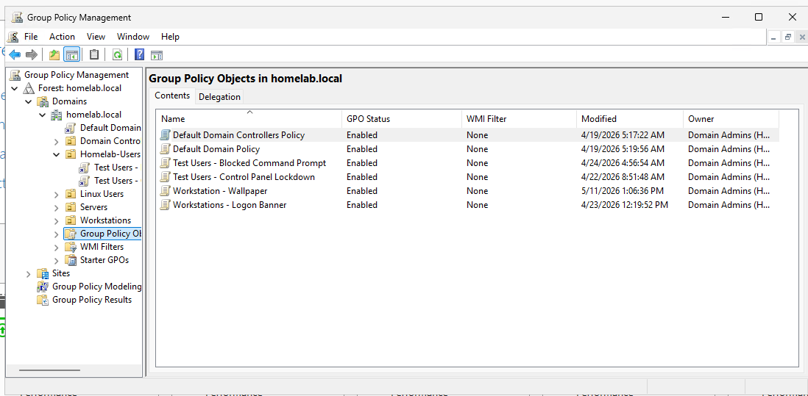
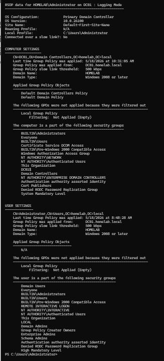
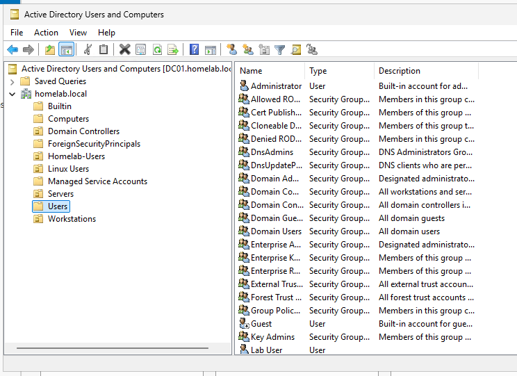

# Windows Server Active Directory and Group Policy

## Overview

This document describes my Windows Server Active Directory and Group Policy (GPO) practice environment inside my homelab.

The goal of this project was to practice:

- Active Directory administration
- Group Policy management
- Domain-joined workstation management
- DNS integration
- Centralized Windows administration
- Windows authentication workflows
- Troubleshooting GPO application issues

## Goals

- Deploy a Windows Server domain controller
- Configure Active Directory services
- Join Windows clients to the domain
- Practice Group Policy management
- Configure internal DNS resolution
- Test domain authentication
- Generate Group Policy reports
- Troubleshoot policy application issues

## Environment

| Component | Description |
|---|---|
| Domain Controller | Windows Server |
| Client Systems | Windows 10/11 Pro |
| Domain | homelab.local |
| DNS Server | Windows Server DNS |
| Server IP | 192.168.10.11 |
| Joined Client Example | 192.168.10.10 |

## Active Directory Deployment

Windows Server was configured as a domain controller for the homelab environment.

Responsibilities included:

- Active Directory Domain Services (AD DS)
- DNS management
- Authentication services
- Group Policy management
- Domain user management

Example domain:

```text
homelab.local
```

## Domain Join Process

Windows client systems were joined to the Active Directory domain.

Validation steps included:

- Successful domain login
- DNS resolution
- Group membership validation
- Domain authentication testing
- Network connectivity validation

## DNS Integration

Windows Server DNS became a critical infrastructure component for the homelab environment.

DNS responsibilities included:

- Internal hostname resolution
- Service discovery
- Authentication support
- Reverse proxy resolution
- Keycloak and Grafana hostname resolution

Example internal DNS records:

```text
grafana.homelab.local
keycloak.homelab.local
uptime.homelab.local
portainer.homelab.local
```

## Group Policy Practice

Group Policy Objects (GPOs) were created and tested against domain-joined systems.

Practice areas included:

- User policies
- Computer policies
- Administrative templates
- Security settings
- Policy refresh validation
- GPO inheritance behavior

## Group Policy Validation

Policy validation was tested using:

```powershell
gpupdate /force
```

and:

```powershell
gpresult /h gpresult.html
```

Validation included:

- Applied GPO verification
- Group membership review
- Policy inheritance testing
- User policy application
- Computer policy application

## Example Troubleshooting

### gpresult Network Path Issue

While generating Group Policy reports, a network path accessibility issue occurred.

Example command:

```powershell
gpresult /h \\192.168.10.11\gpreports\gpresult.html
```

Observed issue:

```text
The path specified is not accessible
```

Troubleshooting steps included:

- Verifying network connectivity
- Confirming shared folder permissions
- Testing DNS resolution
- Validating SMB access
- Reviewing Windows Firewall settings

## Domain Group Validation

Domain-joined systems were verified to be part of multiple Active Directory groups.

Validation included:

- Group membership review
- Policy targeting validation
- User access verification
- Authentication testing

## Skills Practiced

- Active Directory administration
- Group Policy management
- Windows Server administration
- Domain join operations
- DNS management
- Windows authentication troubleshooting
- GPO troubleshooting
- Windows networking
- SMB share validation
- Infrastructure integration

## Lessons Learned

- DNS is critical for Active Directory functionality.
- Group Policy troubleshooting often requires validating both permissions and connectivity.
- GPO reporting tools are valuable for troubleshooting policy application.
- Windows infrastructure services often depend heavily on proper network configuration.
- Domain-based administration simplifies centralized management.
- Authentication and DNS are tightly connected in Active Directory environments.

## Results

Validated results included:

- Windows Server domain controller operational
- Windows clients successfully domain joined
- Internal DNS functioning correctly
- Group Policy validation successful
- gpupdate and gpresult functioning correctly
- Group membership validation completed
- Infrastructure hostname resolution operational

## Future Improvements

- Add organizational units (OUs)
- Create role-based GPO assignments
- Add Windows Server monitoring
- Integrate Active Directory with Keycloak
- Implement centralized logging
- Add PowerShell automation
- Create Active Directory backup procedures
- Add Windows security monitoring



