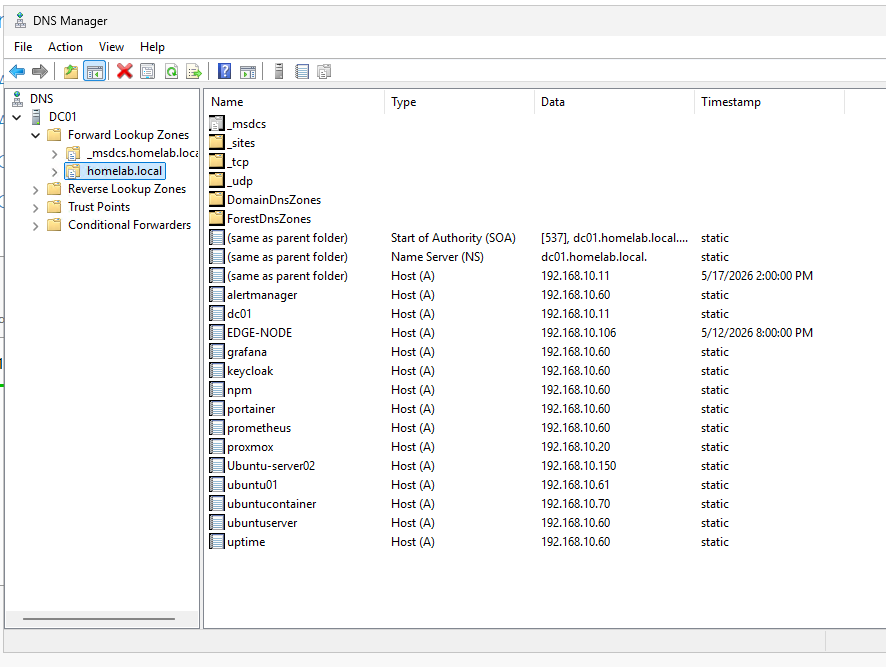

# Windows DNS and IP Management

## Overview

This document describes how Windows Server DNS and internal IP management were configured inside the homelab environment.

The goal of this project was to create reliable internal hostname resolution for infrastructure services, monitoring platforms, reverse proxies, authentication systems, and Kubernetes resources.

## Goals

- Configure Windows Server DNS
- Create internal DNS records
- Support homelab.local internal domain resolution
- Improve infrastructure service accessibility
- Support reverse proxy routing
- Support Keycloak authentication services
- Practice IP management and troubleshooting
- Validate DNS-dependent infrastructure services

## Environment

| Component | Purpose |
|---|---|
| Windows Server DNS | Internal DNS server |
| Domain | homelab.local |
| DNS Server IP | 192.168.10.11 |
| OPNsense Gateway | 192.168.10.1 |
| Nginx Proxy Manager | 192.168.10.60 |
| Grafana | Monitoring dashboards |
| Keycloak | Identity provider |
| Portainer | Container management |
| Uptime Kuma | Service monitoring |

## Internal DNS Architecture

Windows Server DNS became the primary internal DNS service for the homelab environment.

Responsibilities included:

- Internal hostname resolution
- Service discovery
- Reverse proxy hostname routing
- Authentication hostname resolution
- Monitoring service accessibility

Infrastructure services were accessed using fully qualified domain names (FQDNs).

Example:

```text
grafana.homelab.local
```

instead of:

```text
http://192.168.10.x
```

## Example DNS Records

Example internal DNS records:

| Hostname | Purpose |
|---|---|
| grafana.homelab.local | Grafana dashboards |
| keycloak.homelab.local | Keycloak authentication |
| portainer.homelab.local | Portainer management |
| uptime.homelab.local | Uptime Kuma monitoring |
| prometheus.homelab.local | Prometheus metrics |
| npm.homelab.local | Nginx Proxy Manager |

## Reverse Proxy Integration

Nginx Proxy Manager relied heavily on DNS resolution for routing requests to internal services.

Traffic flow:

```text
Client
   ↓
Windows DNS
   ↓
Nginx Proxy Manager
   ↓
Protected Service
```

DNS resolution became a critical dependency for:

- Keycloak authentication
- Grafana dashboards
- oauth2-proxy integrations
- Reverse proxy routing
- HTTPS service access

## IP Address Management

Infrastructure services used static internal IP assignments.

Example infrastructure IPs:

| Service | IP Address |
|---|---|
| Windows Server DNS | 192.168.10.11 |
| OPNsense | 192.168.10.1 |
| Nginx Proxy Manager | 192.168.10.60 |
| Prometheus | 192.168.10.50 |
| Grafana | 192.168.10.60 |
| k3s-master | 192.168.10.80 |
| k3s-worker1 | 192.168.10.81 |
| k3s-worker2 | 192.168.10.82 |

## DNS Validation and Troubleshooting

DNS functionality was validated using:

```powershell
nslookup grafana.homelab.local
```

and:

```bash
ping grafana.homelab.local
```

Validation included:

- Internal hostname resolution
- Reverse proxy accessibility
- Service reachability
- Authentication endpoint accessibility
- Kubernetes node communication

## Example Troubleshooting

### Duplicate IP Address Issue

A Kubernetes worker node was accidentally assigned an IP address already in use by another node.

Observed symptoms included:

- Ping failures
- “Destination host unreachable”
- Intermittent node communication
- Cluster communication problems

Resolution steps included:

- Identifying conflicting IP assignments
- Reassigning static IP addresses
- Restarting network services
- Revalidating connectivity

### DNS Resolution Problems

Some authentication and reverse proxy services failed due to incorrect DNS resolution.

Observed symptoms included:

- Keycloak login failures
- Reverse proxy routing issues
- Invalid redirect behavior
- Service accessibility problems

Troubleshooting included:

- Reviewing Windows DNS records
- Validating hostname resolution
- Checking reverse proxy configurations
- Verifying internal IP assignments

## Skills Practiced

- Windows DNS administration
- Internal DNS design
- IP management
- Static IP assignment
- Network troubleshooting
- Reverse proxy integration
- Infrastructure hostname management
- Kubernetes networking validation
- Linux networking troubleshooting
- Infrastructure dependency mapping

## Lessons Learned

- DNS is one of the most important infrastructure services.
- Reverse proxy environments depend heavily on reliable hostname resolution.
- Internal FQDN usage simplifies infrastructure management.
- Static IP assignments improve infrastructure stability.
- Authentication systems often fail when DNS is misconfigured.
- Infrastructure troubleshooting frequently starts with DNS validation.

## Results

Validated results included:

- Internal DNS operational
- Infrastructure hostnames resolving correctly
- Reverse proxy routing functioning
- Monitoring services accessible through FQDNs
- Kubernetes node communication restored
- Authentication services functioning correctly
- Static IP management operational

## Future Improvements

- Add split-horizon DNS
- Implement DNS redundancy
- Add DHCP reservation management
- Create VLAN-aware DNS segmentation
- Add automated DNS monitoring
- Integrate DNS metrics into Grafana
- Implement centralized IP address management (IPAM)
- Add DNS security monitoring

